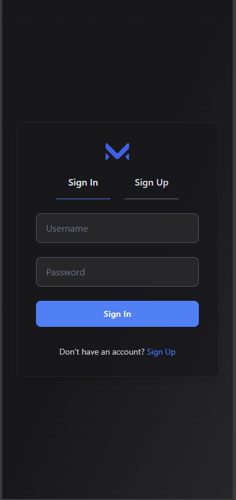
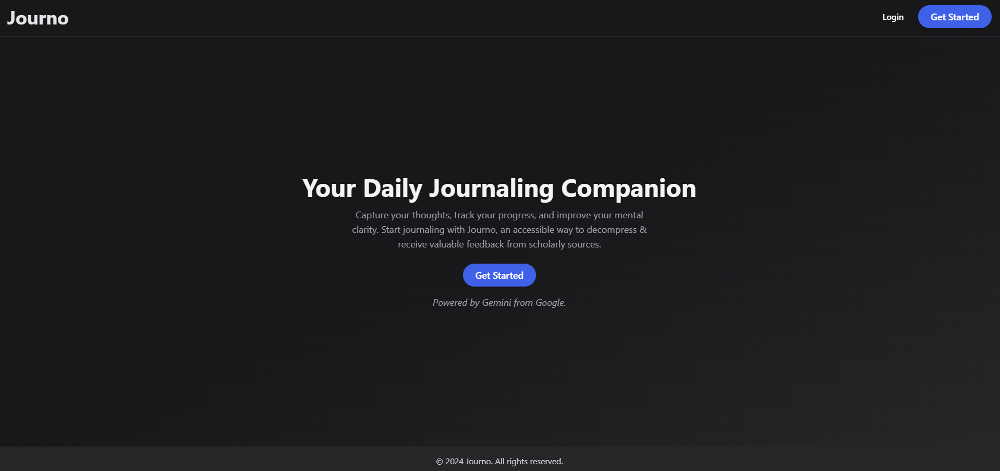
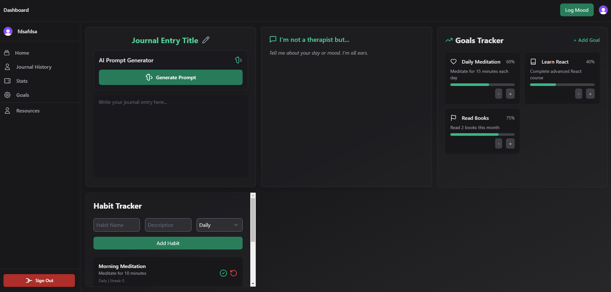
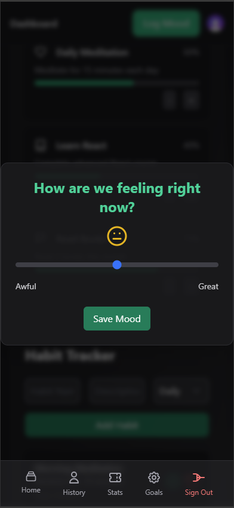
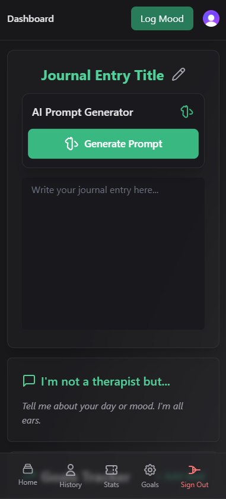
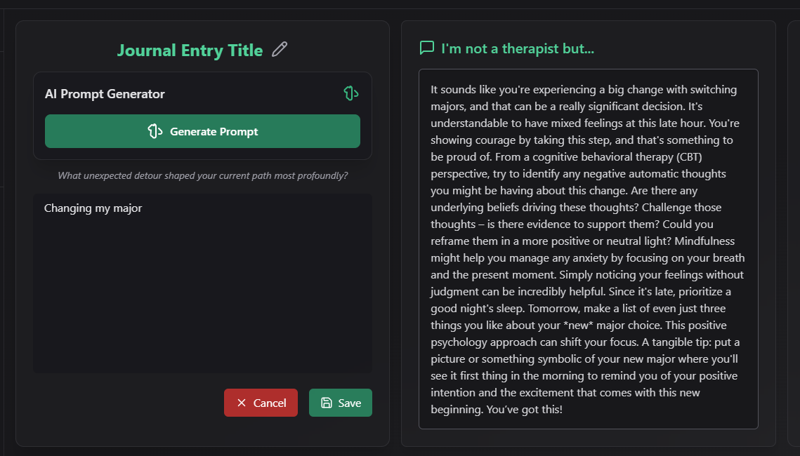

## Journo: A responsive Journaling Web App - AI-Powered Fullstack application built on with Next.js, SQLite and Clerk

This is a full-stack journaling application powered by AI for analyzing user mood and providing feedback based on journal entries. Built with Next.js, the app integrates the Gemini AI API to enhance user journaling experiences, provides robust authentication with Clerk, and features a remote SQLite database hosted on Turso/LibSQL. The application includes secure API implementations, follows middleware route protection principles, and is fully implemented in TypeScript.

## Features

- AI-Powered Assistance: Leverages the Gemini AI API to analyze journal entries and provide mood-based feedback.
- Authentication: User authentication is managed by Clerk, with sign-up, sign-in, and logout functionalities.
- Middleware Route Protection: Ensures that certain pages are protected and accessible only to authenticated users.
- SQLite Database: Utilizes Turso/LibSQL as the database solution, offering fast and remote storage for journal entries.
- Responsive Design: Mobile-first design ensures that the app functions seamlessly across various device sizes.
- Dashboard: Includes a mood tracker and journal entry dashboard, with intuitive UI elements like sliders for tracking mood, shown only once per day.
- TypeScript Integration: The entire codebase is written in TypeScript for improved maintainability and type safety.
- Next.js Routing: Utilizes Next.js App Router for efficient routing, along with API route implementations.

## Technologies Used

Next.js: Full-stack framework for building the application.
TypeScript: Strongly typed JavaScript used for all components.
Docker & Docker Compose: Containerization for local development and lay foundation for production server.
Clerk: For user authentication and secure session management.
SQLite (LibSQL/Turso): Database management with remote storage and connection.
Tailwind CSS: For responsive and modern UI design.
Axios: For making API requests to Gemini AI and other internal services.
Zod: Schema validation for mood entries and other input validation.
Gemini Ai API: API calls using Gemini API LLM's.

## Deployed on: (pending)

# To run on local machine (non Docker option)

set up a .env.local file with the following credentials

TURSO_DATABASE_URL="./db/db.sqlite" (this will get created upon initial registration)
NEXT_PUBLIC_URL=http://localhost:3000

(register for Clerk account (free) and fill in with your own from your project settigngs page)
NEXT_PUBLIC_CLERK_PUBLISHABLE_KEY=
CLERK_SECRET_KEY=
NEXT_PUBLIC_CLERK_FRONTEND_API=

NEXT_PUBLIC_CLERK_SIGN_IN_FALLBACK_REDIRECT_URL=/dashboard
NEXT_PUBLIC_CLERK_SIGN_UP_FALLBACK_REDIRECT_URL=/dashboard

 

 
 

